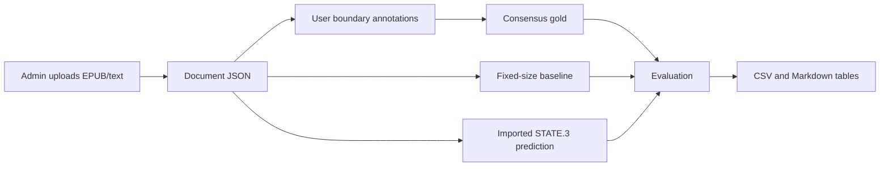

# Scene Chunking Evaluation Plan

## Research Boundary

The project is an annotation and evaluation workbench for scene-aware chunking. It does not implement reader hints, reader-support cards, RAG, QA, or knowledge graph workflows.

The thesis-ready claim is narrow:

> Scene-aware state-change chunking approximates human scene segmentation better than fixed-size chunking.

## Roles

### User

The user role is for annotators. Users can:

- pick an available document and chapter
- mark `boundary_before_pid` positions
- optionally assign one lightweight reason per boundary
- save and resume their own annotation

Users never run pipelines and never annotate entities, places, cast lists, summaries, causal edges, or scene descriptions.

### Admin

The admin role is for the researcher. Admins can:

- upload EPUB or plain text documents
- inspect imported chapters and paragraph counts
- generate fixed-size baseline predictions
- import existing `STATE.3` JSON predictions from `Story-Visualization`
- build consensus gold from multiple annotators
- run evaluation and export result tables
- monitor annotation coverage and per-chapter readiness

## Data Flow

## Evaluation

The main metric is boundary F1 with `+/-1 paragraph` tolerance. Exact F1 and `+/-2 paragraph` F1 are also computed. The dashboard also reports scene count error, nearest-boundary distance, human-human agreement, and consensus confidence counts.

## Minimum Thesis Deliverables

- human annotation JSON for each annotator/chapter
- consensus gold JSON for each chapter
- prediction JSON for fixed-size and `STATE.3`
- method summary CSV
- human agreement CSV
- paper-ready Markdown tables
